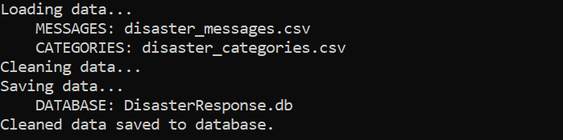
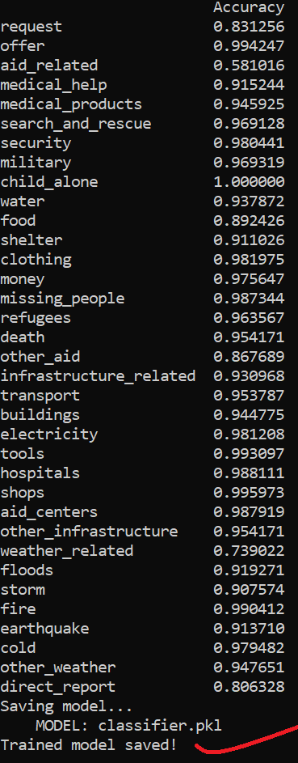

# NLP-ML Disaster Response Pipeline
[![LinkedIn][linkedin-shield]][linkedin-url]
<!-- TABLE OF CONTENTS -->
<details open="open">
  <summary>Table of Contents</summary>
  <ol>
    <li>
      <a href="#about-the-project">About The Project</a>
    </li>
    <li>
      <a href="#getting-started">Getting Started</a>
    </li>
    <li>
      <a href="#etl-pipeline">ETL Pipeline</a>
    </li>
    <li>
    <a href="#ml-pipeline">ML Pipeline</a>
  </li>
 <li>
 <a href="#flask-web-app">Flask Web App</a>
 </li>
  <li>
 <a href="#acknowledgements">Acknowledgements</a>
 </li>
 <li><a href="#contact">Contact</a></li>
  </ol>
</details>

## About The Project
This project analyzes thousands of text messages that were sent during disasters via social media, or directly to disaster response organization. 
This project has an ETL Pipeline that cleans the data, an ML Pipeline that trains a classifier, and a Flask WebApp that allows interaction with the trained model. 

Each of these is described below in more detail.

This model takes in text data, and classifies it into 1 or more of 36 categories of disaster. In practice, this would allow departments to sift through messages and respond more swiftly.


## Getting Started
### Dependencies
-   Python 3.5+ (used Python 3.7)
-   Machine Learning Libraries: NumPy, SciPy, Pandas, Sciki-Learn
-   Natural Language Process Libraries: NLTK
-   SQLite Database Libraries: SQL Alchemy
-   Web App and Data Visualization: Flask, Plotly

### Installing

Clone this Github repository:

```
git clone https://github.com/KareemAyyad/NLP-ML-Disaster-Response-Pipelines
```
### Running Web App:

1.  Run the following commands in the project's root directory to set up your database and model.
    
    -   ETL pipeline by typing the following in your terminal:
`python process_data.py disaster_messages.csv disaster_categories.csv Database.db`

    -  Run this script second to train the model after cleaning:
`python train_classifier.py Database.db classifier.pkl`

2.  Run the following command in the root directory to launch the web app.  `python run.py`
    
3.  Go to  [http://localhost:3001/](http://localhost:3001/)
## ETL Pipeline

#### In a Python script,  `process_data.py`, data cleaning pipeline does the following:


-   Loads the  `messages`  and  `categories`  datasets
-   Merges the two datasets
-   Cleans the data
-   Stores it in a SQLite database



#### 


## ML Pipeline:

### In a Python script, `train_classifier.py`, the pipeline does the following:
-   Loads data from the SQLite database
-   Splits the dataset into training and test sets
-   Builds a text processing and machine learning pipeline
-   Trains and tunes a model using GridSearchCV
-   Outputs results on the test set
-   Exports the final model as a pickle file





## Flask Web App
### The App can be launched by running `python run.py` in the terminal,
 - Packaged into Flask web app.
 - Data is visualized using Plotly in the web app.


<!-- Acknowledgements -->
## Acknowledgements
Thanks to FigureEight for providing this dataset.
Work was reviewed by Udacity instructors.


<!-- CONTACT -->
## Contact

Kareem Ayyad - kareem@ayyad.net

Project Link: [https://github.com/KareemAyyad/NLP-ML-Disaster-Response-Pipelines](https://github.com/KareemAyyad/NLP-ML-Disaster-Response-Pipelines)

[![LinkedIn][linkedin-shield]][linkedin-url]

[linkedin-shield]: https://img.shields.io/badge/-LinkedIn-black.svg?style=for-the-badge&logo=linkedin&colorB=555
[linkedin-url]: https://www.linkedin.com/in/kareemayyad/